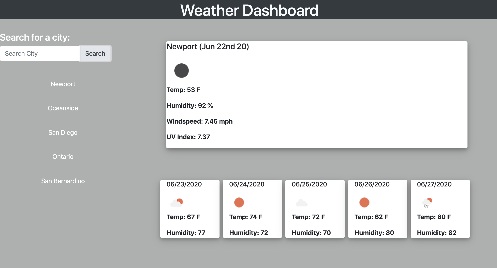

# 06 Server-Side APIs: Weather Dashboard
  [](https://opensource.org/licenses/MIT)

## Table of Contents
  - [Description](#description)
  - [User Story](#userstory)
  - [Installation](#installation)
  - [Built With](#built-with)
  - [License](#license)
  - [Questions](#questions)


  - [Description](#description)
A weather dashboard that will run in the browser and feature dynamically updated HTML and CSS.
The following image demonstrates the application functionality:


## User Story
```
AS A traveler
I WANT to see the weather outlook for multiple cities
SO THAT I can plan a trip accordingly
```
## Installation 
- Clone the GitHub repository
- Right click the file index.html and select "open with live server"

## Built With
- [VScode](https://code.visualstudio.com/) - Editor of choice

## License
MIT License

## Questions
- Github: https://github.com/Monicarangel95


